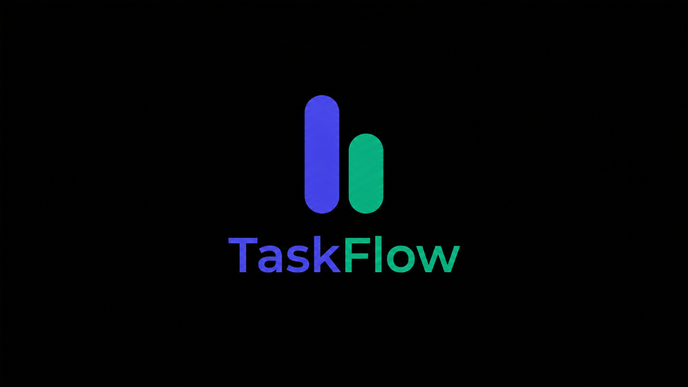

# <span style="color: #4f46e5;">Task</span><span style="color: #10b981;">Flow</span>

<p align="center">
  
</p>

<h1 align="center">
  <span style="color: #4F46E5; font-size: 1.5em; font-weight: 800;">Task</span><span style="color: #10B981; font-size: 1.5em; font-weight: 800;">Flow</span>
</h1>

<p align="center">
  <strong>A premium, lightweight self-hosted Kanban board designed for speed, security, and simplicity.</strong>
</p>

<p align="center">
  <a href="#features">Features</a> •
  <a href="#quick-start">Quick Start</a> •
  <a href="#configuration">Configuration</a> •
  <a href="#api-overview">API Overview</a> •
  <a href="#architecture">Architecture</a> •
  <a href="#development">Development</a>
</p>

<p align="center">
  
  
  
  
</p>

---

## Why TaskFlow?

Most modern task managers are either heavy SaaS products with subscription models and vendor lock-in, or command-line scripts without a graphical UI. **TaskFlow** bridges the gap. It is a lightweight (~1500 LOC), self-hostable Kanban web application that you can run locally, on a VPS, or a Raspberry Pi. 

All your tasks are stored in a single, standard SQLite file that you can back up, move, or edit with standard SQL clients.

---

## Features

- 📋 **Kanban Boards**: Classic layout with *To Do*, *Doing*, and *Done* columns featuring smooth drag-and-drop.
- 🏷️ **Metadata Rich**: Add tags, assign priorities (Low, Medium, High), and set due dates with smart sorting and overdue color-coding.
- 🔍 **Full-Text Search**: Instantly find any card by searching title or description (powered by SQLite FTS5).
- ✍️ **Markdown Support**: Keep clean, formatted task descriptions using secure Markdown rendering.
- ⌨️ **Keyboard Shortcuts**: Power-user friendly with system-wide hotkeys (press `?` to show the shortcuts menu, `n` for a new task, `/` to search).
- 🌓 **Automatic Dark Theme**: Adapts instantly to system light/dark settings, or toggle manual override with a single button.
- 🔌 **Developer API**: A fully documented REST API to script, automate, or integrate with other tools.
- 💾 **Data Ownership**: Single-click JSON import/export in the UI to keep your data portable.
- 🐋 **Docker Ready**: Preconfigured lightweight Docker container support under 60 MB.

---

## Quick Start

### Standard Installation
Make sure you have Node.js (v18+) installed:

```bash
# Clone the repository
git clone https://github.com/physicalaff/taskflow.git
cd taskflow

# Install dependencies
npm install

# Start the server
npm start
```
Open **[http://localhost:3000](http://localhost:3000)** in your browser.

### Docker Setup
Run TaskFlow instantly inside an isolated container:

```bash
# Build the Docker image
docker build -t taskflow .

# Run the container (persisting data on a Docker volume)
docker run -p 3000:3000 -v taskflow-data:/data taskflow
```

---

## Configuration

TaskFlow is easily configured using environment variables. Create a `.env` file or pass them directly in the terminal:

| Variable | Default | Description |
| :--- | :--- | :--- |
| `PORT` | `3000` | Port the web server listens on |
| `DB_PATH` | `./data/tasks.db` | Path to the SQLite database file |
| `AUTH_TOKEN` | *None* | Optional secret token. If set, all API requests require `Authorization: Bearer <token>` |
| `LOG_LEVEL` | `info` | Logging verbosity (`debug`, `info`, `warn`, `error`) |

---

## API Overview

Full documentation is available in [docs/API.md](docs/API.md). Here is a quick reference:

```bash
# Get all tasks
curl http://localhost:3000/api/tasks

# Create a new task
curl -X POST http://localhost:3000/api/tasks \
  -H "Content-Type: application/json" \
  -d '{"title":"Write API documentation","status":"todo","priority":2}'

# Search and filter tasks
curl "http://localhost:3000/api/tasks?q=API&tag=docs"

# Export all tasks to a JSON file
curl http://localhost:3000/api/export > backup.json
```

---

## Architecture

A structured look at how the app is organized. See [docs/ARCHITECTURE.md](docs/ARCHITECTURE.md) for details:

- `src/server.js` — The Express web server, routing, and middleware config.
- `src/db.js` — Database connection initialization and schema migrations.
- `src/routes/` — Individual API routes structured by domain.
- `public/` — Zero-build static frontend (vanilla CSS, HTML, and ES module JavaScript).

---

## Development

Set up a local development environment with automatic server restart and tests:

```bash
# Run server in development mode (with nodemon)
npm run dev

# Run unit and API tests
npm test

# Run code style linter
npm run lint
```

---

## License

This project is licensed under the MIT License. See [LICENSE](LICENSE) for details.
